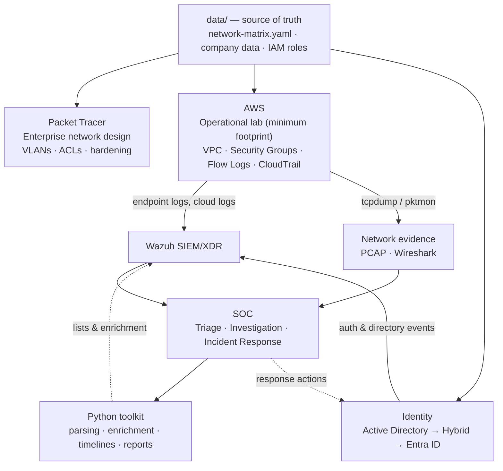

# Moretti Group Security Lab

[Português](README.md) | **English**

> **Moretti Group — Private Investment & Technology** is a **fictional** company.
> Every person, credential, asset, and dataset in this repository is fictitious and exists
> only for learning. No real personal data, real credentials, or third-party systems are used.

An integrated cybersecurity laboratory that models a ~70-employee company end to end:
enterprise network design, cloud security implementation, identity and access management,
security monitoring, network forensics, incident response, and security automation.

The lab is built as **one system, not five separate exercises**. A single set of policy
files (the *source of truth*) drives the network design, the cloud controls, the identity
model, and the detection logic, and every lab scenario can be traced across all of them.

---

## Architecture at a glance



| Layer | Role in the lab |
|---|---|
| **Packet Tracer** | Complete enterprise network design (the "headquarters") |
| **AWS** | Minimum viable operational lab — real hosts, real logs, real traffic |
| **Entra ID** | Cloud identity: MFA, Conditional Access, identity lifecycle |
| **Wazuh** | Log centralization and detection |
| **Wireshark / tcpdump** | Network evidence |
| **Python** | The glue: parsing, enrichment, timelines, report generation |

**Key design principle:** AWS is *not* a copy of the Packet Tracer network. Both environments
implement **the same communication policy** (`network-matrix.yaml`) using the controls that are
appropriate to each environment — VLANs and ACLs on-premises, VPC subnets and Security Groups in
the cloud. See [ADR-005](docs/adr/ADR-005-lab-vs-enterprise.md).

Full details: [docs/architecture.md](docs/architecture.md).

---

## Projects

| # | Project | Focus | Status |
|---|---|---|---|
| 01 | [Network](project-01-network/) | Segmentation, VLANs, ACLs, firewalling, device hardening | Configs ready, build pending |
| 02 | [PCAP Analysis](project-02-pcap/) | Structured network forensics and investigation reports | Planned |
| 03 | [SOC](project-03-soc/) | Wazuh, detection engineering, alert triage, incident response | Planned |
| 04 | [IAM](project-04-iam/) | AD, Entra ID, RBAC, MFA, Joiner/Mover/Leaver, access reviews | Planned |
| 05 | [Python Automation](project-05-python/) | Log parsing, IOC extraction, enrichment, reporting | Planned |

Implementation follows a phased roadmap: [docs/roadmap.md](docs/roadmap.md).

## Architecture decisions

Every significant decision — including deliberate limitations — is recorded as an
Architecture Decision Record in [docs/adr/](docs/adr/).

| ADR | Decision |
|---|---|
| [001](docs/adr/ADR-001-source-of-truth.md) | Policy files in `data/` are the single source of truth |
| [002](docs/adr/ADR-002-cloud-platform.md) | AWS for infrastructure, Entra ID for cloud identity |
| [003](docs/adr/ADR-003-single-az.md) | Single-AZ deployment as an intentional cost optimization |
| [004](docs/adr/ADR-004-egress-strategy.md) | Terraform-controlled egress; NAT choice deferred until measured |
| [005](docs/adr/ADR-005-lab-vs-enterprise.md) | Packet Tracer = enterprise design; AWS = operational lab |
| [006](docs/adr/ADR-006-identity-evolution.md) | Identity evolves on-prem → hybrid → cloud |
| [007](docs/adr/ADR-007-minimum-footprint.md) | Minimum VM footprint, grown per phase |
| [008](docs/adr/ADR-008-network-enforcement-points.md) | Core switch ACLs east-west, ASA at the perimeter, NAT at the edge |

## Safety

This lab is designed so that it **cannot** accidentally become an exposed, vulnerable
environment:

- No administrative service is exposed to the internet; access is brokered (AWS SSM).
- All offensive testing stays inside the lab's own address space and AWS account.
- No real credentials or secrets in Git — enforced by `gitleaks` via `pre-commit`.
- Only fictitious identities and data.
- The entire cloud environment can be destroyed and recreated from code.

Read [docs/lab-safety.md](docs/lab-safety.md) before running anything.

## Repository layout

```
.
├── data/                  # Source of truth (policy, company, assets, IAM roles)
├── docs/                  # Cross-project documentation and ADRs
├── scenarios/             # End-to-end lab scenarios (SCN-xx) traced across projects
├── project-01-network/    # Packet Tracer design, device configs, network docs
├── project-02-pcap/       # Captures, analysis, investigation reports
├── project-03-soc/        # Wazuh config, detections, alerts, incidents, playbooks
├── project-04-iam/        # Users, groups, policies, lifecycle, access reviews
├── project-05-python/     # Automation toolkit (src, tests, examples)
└── infrastructure/        # Terraform and operational scripts
```

## Getting started (contributors)

```bash
# 1. Install the Git hooks that block secrets and malformed files
pip install pre-commit
pre-commit install

# 2. Create a local environment file (never committed)
cp .env.example .env

# 3. Run all checks manually
pre-commit run --all-files
```

Cloud deployment instructions will be added in Phase 4 (see the roadmap).

## License

[MIT](LICENSE)
