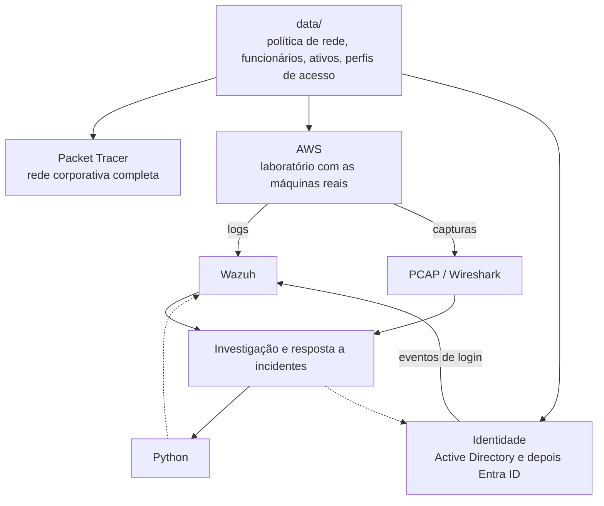

# Moretti Group Security Lab

**Português** | [English](README.en.md)

Laboratório de cibersegurança que eu estou montando em cima de uma empresa fictícia, a
Moretti Group (Private Investment & Technology), com uns 70 funcionários, setores, servidores e
níveis de acesso diferentes.

A ideia surgiu porque eu queria praticar segurança de um jeito mais parecido com o dia a dia de
uma empresa de verdade, e não com exercícios soltos. Então tudo aqui faz parte do mesmo ambiente:
a rede que eu desenho no Packet Tracer, as máquinas que sobem na AWS, os usuários no Active
Directory, os logs que vão para o Wazuh e os scripts em Python que eu uso para analisar tudo isso.

Nada aqui é real. Nomes, usuários, senhas e dados são inventados, e qualquer teste de ataque
acontece só dentro do próprio laboratório.

## Como o laboratório funciona



O ponto central é a pasta `data/`. É lá que fica definido quem pode falar com quem na rede, quem
trabalha em qual setor e quais acessos cada função tem. O Packet Tracer, a AWS, o AD e os scripts
leem desse mesmo lugar, então se eu mudo uma regra, ela muda em todo o laboratório.

Uma decisão que eu tomei logo no começo: a AWS não é uma cópia da rede do Packet Tracer. No Packet
Tracer eu desenho a rede inteira da empresa, com VLANs, ACLs e firewall. Na AWS eu subo só as
máquinas necessárias para gerar log e tráfego de verdade. As duas seguem a mesma política de
comunicação, cada uma com os controles que fazem sentido no seu ambiente (ACL de um lado, Security
Group do outro).

## Os cinco projetos

| | Projeto | O que tem |
|---|---|---|
| 01 | [Rede](project-01-network/) | Segmentação, VLANs, ACLs, firewall, hardening dos equipamentos |
| 02 | [Análise de tráfego](project-02-pcap/) | Investigações em PCAP com timeline e relatório |
| 03 | [SOC](project-03-soc/) | Wazuh, regras de detecção, triagem de alertas, resposta a incidentes |
| 04 | [IAM](project-04-iam/) | AD, Entra ID, RBAC, MFA, entrada/mudança/saída de funcionários, revisão de acessos |
| 05 | [Python](project-05-python/) | Parser de logs, extração de IOCs, enriquecimento e geração de relatórios |

Estou construindo por fases, e o andamento fica em [docs/roadmap.md](docs/roadmap.md).

## Decisões de arquitetura

Anotei cada decisão importante em [docs/adr/](docs/adr/), com as opções que considerei e o motivo
da escolha. Isso inclui as limitações que aceitei de propósito, como rodar tudo em uma única zona
de disponibilidade para economizar.

| ADR | Decisão |
|---|---|
| [001](docs/adr/ADR-001-source-of-truth.md) | A pasta `data/` é a fonte única de verdade |
| [002](docs/adr/ADR-002-cloud-platform.md) | AWS para infraestrutura, Entra ID para identidade |
| [003](docs/adr/ADR-003-single-az.md) | Uma única zona de disponibilidade, por custo |
| [004](docs/adr/ADR-004-egress-strategy.md) | Saída para internet controlada pelo Terraform |
| [005](docs/adr/ADR-005-lab-vs-enterprise.md) | Packet Tracer para o desenho, AWS para o laboratório |
| [006](docs/adr/ADR-006-identity-evolution.md) | Identidade evoluindo de AD para híbrido e depois nuvem |
| [007](docs/adr/ADR-007-minimum-footprint.md) | Começar com poucas máquinas e crescer por fase |

A documentação técnica (ADRs, arquitetura, relatórios) está em inglês.

## Segurança do próprio laboratório

Como o lab gera ataques de propósito, tomei alguns cuidados para ele não virar um problema:

- nenhuma porta de administração fica aberta para a internet, o acesso às máquinas é pelo AWS SSM;
- os testes de ataque ficam restritos à rede do laboratório;
- senhas e chaves nunca vão para o Git, e o gitleaks bloqueia o commit se algo escapar;
- o ambiente na AWS pode ser destruído e recriado pelo Terraform a qualquer momento.

As regras completas estão em [docs/lab-safety.md](docs/lab-safety.md).

## Estrutura

```
data/                 política de rede, empresa, ativos e perfis de acesso
docs/                 arquitetura, roadmap, regras do lab e ADRs
scenarios/            cenários de ponta a ponta (SCN-01, SCN-02...)
project-01-network/   Packet Tracer e configurações
project-02-pcap/      capturas e relatórios de investigação
project-03-soc/       Wazuh, detecções, alertas e incidentes
project-04-iam/       usuários, grupos, políticas e ciclo de vida
project-05-python/    ferramentas de automação
infrastructure/       Terraform e scripts
```

## Rodando localmente

```bash
pip install pre-commit
pre-commit install
cp .env.example .env
pre-commit run --all-files
```

O passo a passo para subir o ambiente na AWS entra quando eu chegar na fase 4.

## Licença

[MIT](LICENSE)
