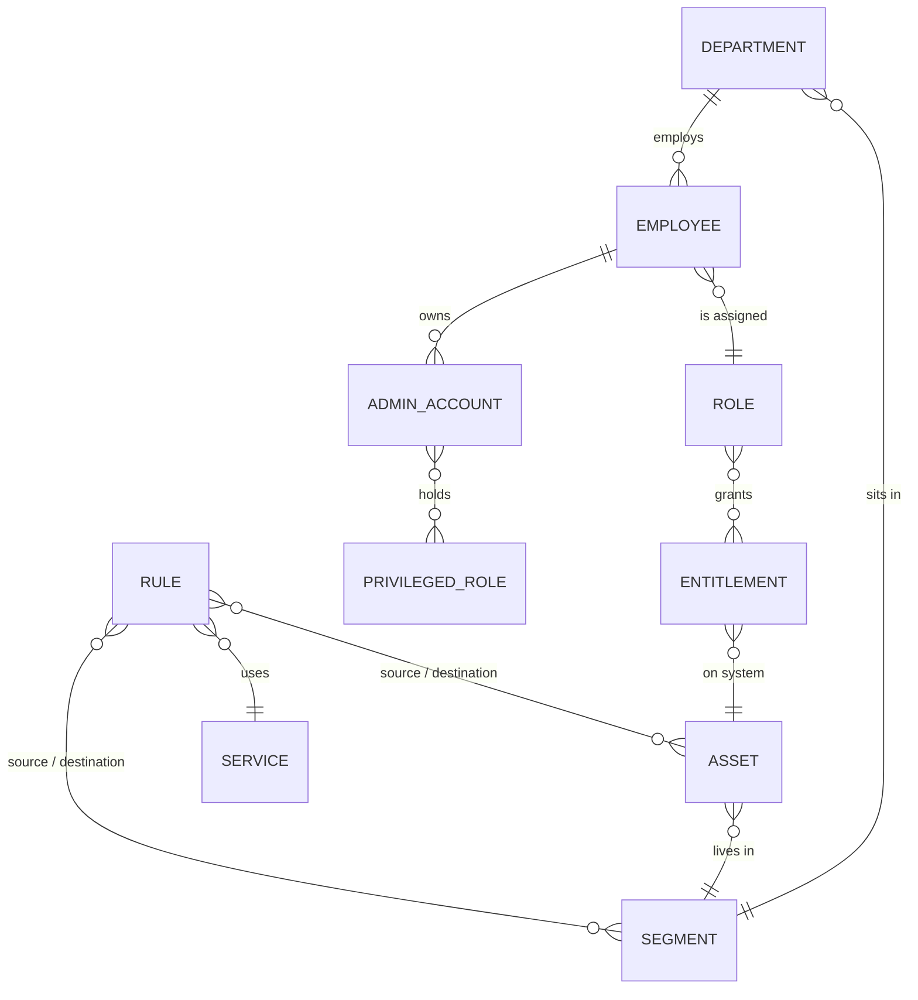

# data/ — Fonte da verdade

**Português** | [English](README.en.md)

Aqui ficam os dados da empresa e as políticas em formato que tanto gente quanto código conseguem
ler. Todos os outros projetos usam estes arquivos, então é aqui que se muda uma regra
([ADR-001](../docs/adr/ADR-001-source-of-truth.md)). **Todos os dados são fictícios.**

| Arquivo | O que tem | Quem usa |
|---|---|---|
| [`company.yaml`](company.yaml) | Empresa, unidades de negócio, setores, domínios de dados e seus donos | IAM, Python, threat model |
| [`employees.csv`](employees.csv) | Funcionários fictícios: setor, função, gestor, status e datas | Criação de usuários no AD, enriquecimento no Python, listas do Wazuh |
| [`accounts.yaml`](accounts.yaml) | Contas de administrador, de serviço e de emergência (break-glass) | IAM, listas do Wazuh, revisão de acessos |
| [`roles.yaml`](roles.yaml) | Permissões, funções de negócio e funções privilegiadas (modelo AGDLP) | RBAC no AD, revisão de acessos |
| [`assets.yaml`](assets.yaml) | Servidores, estações e equipamentos de rede: segmento, IP, dono, criticidade, onde existe | Packet Tracer, Terraform, enriquecimento no Python |
| [`network-matrix.yaml`](network-matrix.yaml) | Segmentos, serviços e as regras de ALLOW/DENY com justificativa | ACLs do Packet Tracer, Security Groups da AWS, validações |
| [`schemas/`](schemas/) | Schemas que o `pre-commit` usa para barrar arquivo mal escrito | — |

Os arquivos têm nomes e campos em inglês para poderem ser lidos direto pelo Terraform, pelo
PowerShell e pelo Python.

## Como os arquivos se ligam

Em palavras: cada funcionário pertence a um setor e tem uma função. A função dá um conjunto de
permissões, e cada permissão vale num sistema específico. Cada setor fica num segmento de rede, e
as regras da matriz dizem quais segmentos e servidores podem conversar.

## Casos já preparados para as próximas fases

| Registro | Para que serve |
|---|---|
| MG-0097 `terminated` | Funcionário desligado que tenta logar (cenário SCN-02) |
| MG-0024 `on_leave` | Revisão de acessos: o que fazer com o acesso de quem está de licença |
| MG-0074, terceirizado até 30/10/2026 | Acesso com data para acabar (entrada, mudança e saída) |
| MG-0046 e MG-0073, estagiários | Acesso com prazo |
| `svc-vulnscan` | Scanner autorizado que gera o falso positivo do cenário FP-01 |
| `bg-admin01` | Conta de emergência: qualquer uso vira alerta crítico |

## Convenções

- IDs de funcionário `MG-NNNN`; usuários `nome.sobrenome` (minúsculo, sem acento); contas admin
  `adm-<usuario>`; contas de serviço `svc-*`; break-glass `bg-*`.
- Grupos do AD: `GG-Role-*` (um por função) dentro de `DL-*` (um por permissão).
- Referências nas regras de rede: `seg:<id>`, `grp:<id>`, `asset:<ID>`, `internet`.
- As regras são lidas em ordem, vale a primeira que bater, e o que não bate em nenhuma é bloqueado.
