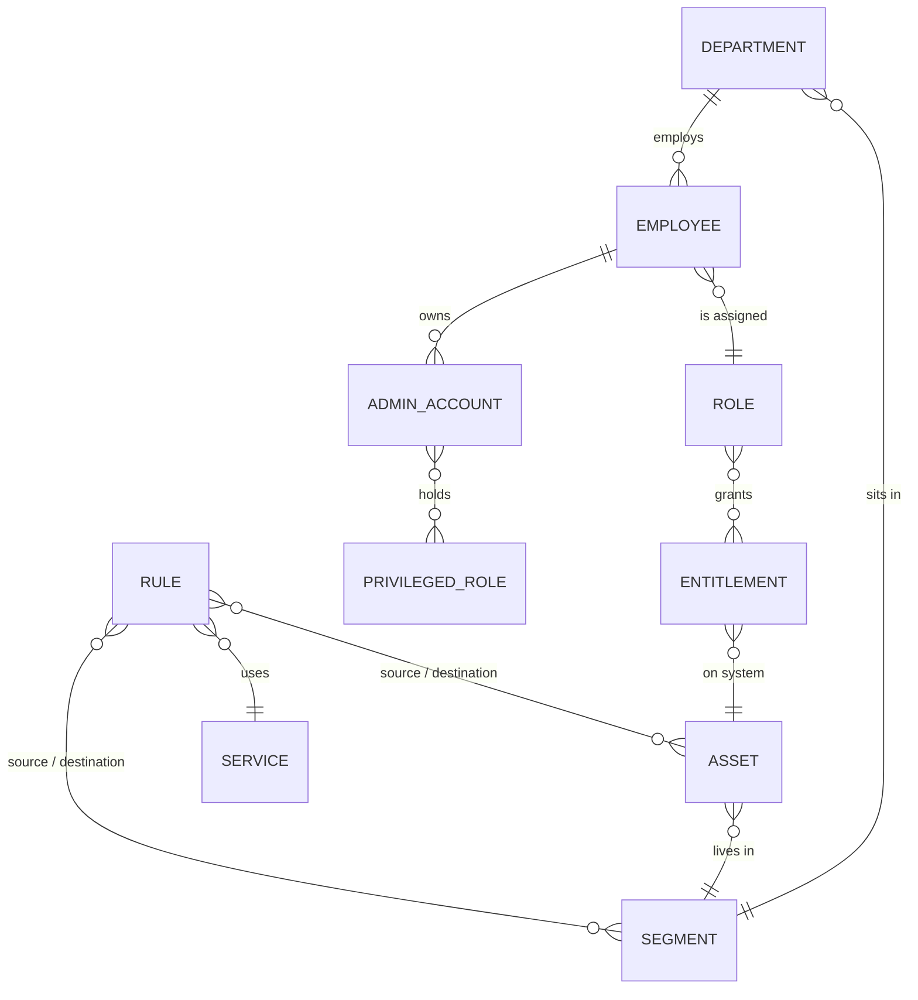

# data/ — Source of truth

Machine-readable policy and company data consumed by every project
([ADR-001](../docs/adr/ADR-001-source-of-truth.md)). **All data here is fictitious.**

| File | Content | Consumers |
|---|---|---|
| [`company.yaml`](company.yaml) | Company profile, business units, departments, data domains and owners | P04, P05, threat model |
| [`employees.csv`](employees.csv) | Fictitious employees: department, role, manager, status, dates | P04 AD provisioning, P05 enrichment, Wazuh lists |
| [`accounts.yaml`](accounts.yaml) | Admin, service and break-glass accounts | P04, Wazuh lists, access reviews |
| [`roles.yaml`](roles.yaml) | Entitlements, business roles and privileged roles (AGDLP) | P04 RBAC, access reviews |
| [`assets.yaml`](assets.yaml) | Hosts and network devices: segment, IP, owner, criticality, environment | P01, Terraform, P05 enrichment |
| [`network-matrix.yaml`](network-matrix.yaml) | Segments, services and ordered allow/deny rules with justification | P01 ACLs, Terraform Security Groups, P05 validation |
| [`schemas/`](schemas/) | JSON Schemas enforced by `pre-commit` on every commit | — |

## How the files relate

## States prepared for later phases

| Record | Purpose |
|---|---|
| MG-0097 `terminated` | Leaver scenario: logon attempt by a terminated account (SCN-02) |
| MG-0024 `on_leave` | Access review: what happens to access during a leave of absence |
| MG-0074 contractor, end date 2026-10-30 | Joiner/Mover/Leaver: time-bound access |
| MG-0046, MG-0073 interns | Time-bound access |
| `svc-vulnscan` | Authorized scanner, source of the false-positive scenario (FP-01) |
| `bg-admin01` | Break-glass account: any use is a critical alert |

## Conventions

- Employee IDs `MG-NNNN`; usernames `firstname.lastname` (lowercase ASCII); admin accounts
  `adm-<username>`; service accounts `svc-*`; break-glass `bg-*`.
- AD groups: `GG-Role-*` (global, one per role) nested into `DL-*` (domain local, one per
  entitlement).
- Network references in rules: `seg:<id>`, `grp:<id>`, `asset:<ID>`, `internet`.
- Rules are evaluated in order; first match wins; default deny.
