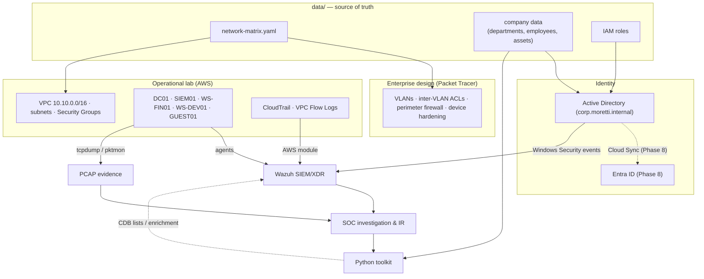
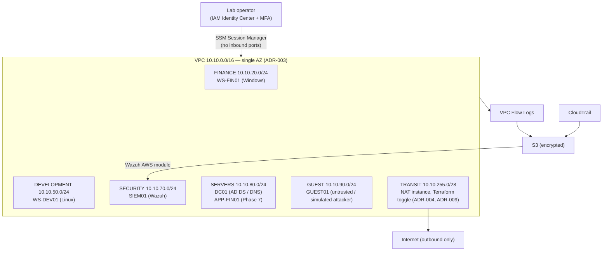
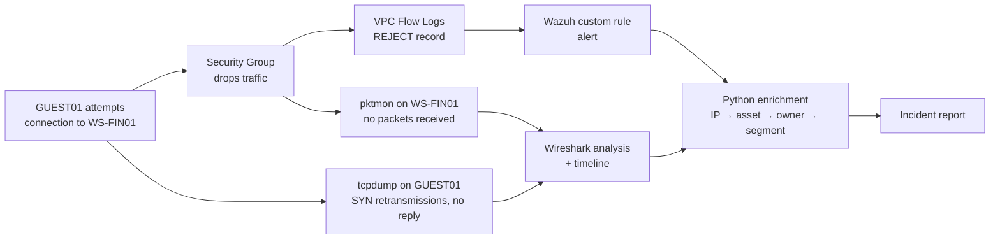

# Architecture

This document describes the overall architecture of the Moretti Group Security Lab and how its
five projects form a single, integrated system. Decisions referenced here are recorded in
[`docs/adr/`](adr/).

> Company data, the full communication matrix, the asset inventory and the roles live in
> [`data/`](../data/). This document explains how they fit together.

---

## 1. Goals

1. Demonstrate real security engineering practice across network, cloud, identity, monitoring,
   forensics, incident response and automation.
2. Keep every project connected: information produced by one project is consumed by another.
3. Stay **safe** (no exposed administrative surface, fictitious data only) and **cheap**
   (minimum footprint, destroyable, measured costs).
4. Document **why** each decision was made, including deliberate limitations.

## 2. Architectural principles

| Principle | How it is applied |
|---|---|
| **Single source of truth** | Communication policy, company data and IAM roles live in `data/` and are consumed by every project ([ADR-001](adr/ADR-001-source-of-truth.md)). |
| **Same policy, different controls** | Packet Tracer and AWS implement the same policy with environment-appropriate controls; AWS is not a copy of the LAN ([ADR-005](adr/ADR-005-lab-vs-enterprise.md)). |
| **Default deny / least privilege** | Every flow and every permission must be justified by a business need; everything else is denied. |
| **No public administration** | No inbound administrative port is exposed to the internet; access is brokered by AWS SSM. |
| **Limitations are decisions** | Cost-driven or tooling-driven compromises are written down as ADRs, not hidden. |
| **Evidence over assertion** | Lab results are only documented from observed data. What cannot be determined is stated as such. |
| **Disposable infrastructure** | The cloud lab is created and destroyed from Terraform. |

## 3. Logical architecture

### Layer responsibilities

| Layer | Implemented with | Responsibility | Project |
|---|---|---|---|
| Enterprise network design | Cisco Packet Tracer | Full corporate LAN: VLANs, inter-VLAN ACLs, perimeter firewall, DMZ, device hardening | P01 |
| Operational lab | AWS | Minimum set of real hosts producing real logs and traffic | Infrastructure |
| Cloud identity | Entra ID | MFA, Conditional Access, identity lifecycle | P04 |
| On-prem identity | Active Directory | Users, groups, OUs, GPOs, RBAC, password/lockout policy | P04 |
| Detection | Wazuh | Centralization, correlation, custom rules | P03 |
| Network evidence | tcpdump, pktmon, Wireshark | Packet-level evidence of scenarios | P02 |
| Automation | Python | Parsing, enrichment, timelines, IOC extraction, reports | P05 |

## 4. Network segmentation model

Both environments use the same segment identifiers and address plan so that a flow in the matrix
means the same thing everywhere. The table below is the **segment plan**; the flows between
segments are defined in [`data/network-matrix.yaml`](../data/network-matrix.yaml).

| ID | Segment | CIDR | Packet Tracer | AWS lab |
|---|---|---|---|---|
| 10 | NET-MGMT (network device management) | 10.10.10.0/24 | VLAN 10 | — (SSM replaces it) |
| 20 | FINANCE | 10.10.20.0/24 | VLAN 20 | Subnet |
| 30 | HR | 10.10.30.0/24 | VLAN 30 | — |
| 40 | INVESTOR-RELATIONS | 10.10.40.0/24 | VLAN 40 | — |
| 50 | DEVELOPMENT | 10.10.50.0/24 | VLAN 50 | Subnet |
| 60 | IT (IT + Support) | 10.10.60.0/24 | VLAN 60 | — |
| 70 | SECURITY | 10.10.70.0/24 | VLAN 70 | Subnet |
| 80 | SERVERS | 10.10.80.0/24 | VLAN 80 | Subnet |
| 90 | GUEST (internet only) | 10.10.90.0/24 | VLAN 90 | Subnet |
| 100 | EXECUTIVE | 10.10.100.0/24 | VLAN 100 | — |
| 110 | OPERATIONS (fund back office) | 10.10.110.0/24 | VLAN 110 | — |
| 120 | INVESTMENTS | 10.10.120.0/24 | VLAN 120 | — |
| 999 | BLACKHOLE (native / unused ports) | — | VLAN 999 | — |
| DMZ | Public services | 172.16.100.0/24 | Firewall DMZ | — |
| TRANSIT | Core ↔ firewall ↔ edge router links | 10.10.255.0/24 | Routed /30 links | — |

Notes:

- Support shares segment 60 with IT; the two are separated by **identity** (different AD groups
  and delegated permissions), not by network. This intentionally shows that network segmentation
  is not a substitute for authorization.
- AWS reserves `.1` of each subnet for the VPC router, which matches the gateway convention used
  in Packet Tracer (`.1`).

### Control translation between environments

| Policy concept | Packet Tracer | AWS |
|---|---|---|
| Segment | VLAN + SVI | Subnet |
| Allowed flow | Extended ACL `permit` | Security Group ingress rule |
| Denied flow | Extended ACL `deny` (explicit) | Absence of an allow rule; Network ACL where an explicit deny is required |
| Statefulness | Stateless (return traffic must be permitted) | Stateful |
| Perimeter | ASA firewall + edge router | No inbound internet path; controlled egress |
| Device administration | SSH from NET-MGMT only | SSM Session Manager (no inbound ports) |

Each rule in the matrix will carry an `applies_to` field (`pt`, `aws`, or both) because some flows
only exist in one environment (for example, SSH to switches).

## 5. Cloud architecture (AWS)

| Control | Purpose |
|---|---|
| No inbound internet rules | Removes the public administrative attack surface |
| SSM Session Manager + port forwarding | Shell, RDP and Wazuh dashboard access without open ports |
| Security Groups generated from the matrix | Policy and implementation cannot drift apart silently |
| VPC Flow Logs (1-minute aggregation) | Network evidence independent of the hosts |
| CloudTrail | Audit trail of every control-plane action |
| IMDSv2 required, encrypted EBS | Baseline host hardening |
| AWS Budgets alerts | Cost guardrail |
| Scheduled shutdown | Instances do not run when the lab is not in use |
| Egress toggle | Outbound access exists only when a phase needs it |

Footprint (ADR-007): **DC01, SIEM01, WS-FIN01, WS-DEV01, GUEST01**, deployed per phase on Spot and
Graviton where possible, with a NAT instance for egress (ADR-009). APP-FIN01 is added in
the scenarios phase. SEC-WS01 is deferred; PCAP analysis runs on the operator's workstation.

## 6. Identity architecture

Identity evolves in stages (ADR-006):

1. **On-prem** — Active Directory `corp.moretti.internal` on DC01: OUs, users, groups, GPOs, RBAC,
   password and lockout policies, delegated administration, separate admin accounts.
2. **Hybrid** — Entra ID tenant synchronized from AD (Entra Cloud Sync).
3. **Cloud** — MFA, Conditional Access (requires Entra ID P1; trial license), identity lifecycle.

Lab operator identity (AWS IAM Identity Center) is a **separate control plane** from the fictitious
company identities and is never mixed with them.

## 7. Cross-project data flow

Each lab scenario has an identifier (`SCN-xx`) that is reused in capture filenames, alert
references, incident reports and generated reports, so a single event can be traced across every
source.

Example — **SCN-04: segmentation violation (GUEST → FINANCE)**:

Known constraints for this correlation (documented, not hidden):

- Security Groups drop packets before they reach the destination host, so the **source-side**
  capture is the primary packet evidence; the empty destination-side capture corroborates that
  enforcement happened at the Security Group.
- Flow Logs aggregate per capture window (1 minute minimum), so timelines combine
  second-level (PCAP) and minute-level (Flow Logs) precision.
- The Wazuh AWS module polls S3, so cloud-sourced alerts are delayed relative to the event.
- All hosts synchronize with the Amazon Time Sync Service so timestamps are comparable.

## 8. Related documents

- [Roadmap](roadmap.md)
- [Threat model](threat-model.md)
- [Data classification](data-classification.md)
- [Lab safety and rules of engagement](lab-safety.md)
- [Architecture Decision Records](adr/)
