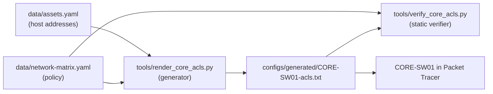

# ACL Design

How the communication matrix becomes device configuration, and why the ACLs look the way they
do. Decision record: [ADR-008](../../docs/adr/ADR-008-network-enforcement-points.md).

## 1. Pipeline



- The ACL file is **generated**, never edited by hand.
- `pre-commit` fails if the generated file is stale (`--check`) or if the verifier finds any
  difference between the ACLs and the matrix.
- FW01 and R-EDGE01 rule bases are small and written by hand, with the matrix rule ID in each
  `remark`.

## 2. Where each rule is enforced

| Traffic | Enforced by | Example rules |
|---|---|---|
| Internal VLAN → internal VLAN | CORE-SW01, ACL inbound on the source SVI | NM-010, NM-020 to NM-027, NM-060 |
| Internal VLAN → core itself (SSH, ping) | CORE-SW01, same ACL | NM-032, NM-080 |
| Internal → internet | CORE-SW01 (first) and FW01 `INSIDE_IN` (second) | NM-005, NM-013, NM-070, NM-071 |
| Internet → DMZ / internal | FW01 `OUTSIDE_IN`, R-EDGE01 anti-spoofing | NM-001, NM-002 |
| DMZ → anything | FW01 `DMZ_IN` | NM-003 |
| Transit devices → internal (syslog, NTP) | FW01 `OUTSIDE_IN` for R-EDGE01 | NM-012, NM-041 |
| Inside one VLAN | **Not filtered** (no routing hop) | — |

## 3. Generation rules

1. Only rules with `applies_to: [pt, ...]` are used.
2. A rule is written into the ACL of **every source segment** it names, in matrix order, so
   "first match wins" keeps the same meaning per source.
3. Destinations inside the source's own VLAN are skipped (the core never sees that traffic),
   **except** the VLAN gateway, which is the core itself.
4. `internet` means "not private". Internal rules are rendered first, then a guard that denies
   RFC 1918 space, then internet rules. Internal and internet destinations are disjoint, so this
   reordering does not change any decision.
5. Adjacent addresses are merged (DC01 + DC02 → `10.10.80.10 0.0.0.1`).
6. **Return traffic.** For every ALLOW, the ACL of the destination VLAN receives:
   - TCP: `permit tcp <responder> <initiator> established`
   - UDP: `permit udp <responder> eq <service port> <initiator>`
   - ICMP: `permit icmp <responder> <initiator> echo-reply`

   When a responder answers three or more internal networks on the same port, one entry towards
   `10.10.0.0/16` replaces them.
7. **Redundant entries are removed.** An explicit DENY with no later PERMIT that could match the
   same traffic is replaced by a `remark ... (enforced by default deny)`: the final
   `deny ip any any` already drops it. A PERMIT fully covered by an earlier PERMIT is dropped.
8. Infrastructure entries not in the matrix, listed explicitly:
   - ping to the VLAN's own gateway (basic troubleshooting for every user);
   - DHCP broadcasts (`0.0.0.0 → 255.255.255.255` and renewals by broadcast), required for DHCP
     relay and the guest pool.

## 4. Worked example: NM-020

```yaml
- id: NM-020
  source: [seg:finance, seg:executive, seg:operations]
  destination: [asset:APP-FIN01]
  service: https
  action: allow
```

Becomes, in three source ACLs:

```
ip access-list extended ACL-IN-FINANCE
 remark NM-020 allow https
 permit tcp 10.10.20.0 0.0.0.255 host 10.10.80.30 eq 443
```

(and the same in `ACL-IN-EXECUTIVE` and `ACL-IN-OPERATIONS`), plus one return entry in the
servers ACL, aggregated because three networks are involved:

```
ip access-list extended ACL-IN-SERVERS
 permit tcp host 10.10.80.30 10.10.0.0 0.0.255.255 established
```

## 5. Verification

`tools/verify_core_acls.py` evaluates, for every test endpoint pair in different segments and
every port defined in the matrix services (plus two ports no rule allows):

- the **matrix decision** (first match, default deny), and
- the **ACL decision** in the source VLAN's ACL (first match; a new connection never matches
  `established`),

and fails on any difference. For every allowed flow it also checks that the reply is permitted
by the destination VLAN's ACL. Negative tests (removing a permit, opening Guest → Finance,
removing a return entry) were run to confirm the verifier detects each kind of error.

This is **static analysis of configuration text**. It proves the ACLs match the policy as
written; it does not prove Packet Tracer behaves identically. That is what the
[validation plan](validation-plan.md) is for.

## 6. Known limitations of stateless ACLs

| Limitation | Effect | Accepted because | Production alternative |
|---|---|---|---|
| `established` matches any TCP packet with ACK or RST | A host can send ACK packets (e.g. ACK scans) towards an initiator network; it still cannot open a connection | Standard trade-off of stateless filtering | Stateful firewall / zone-based firewall |
| UDP replies are matched by source port | A host could send UDP traffic using a service port as source (e.g. from DC01 port 53) | Limited to the responder address and port | Stateful inspection |
| No UDP return traffic for `any` services | UDP scans from SEC-WS01 (NM-028) get no replies | Allowing it would open all UDP towards the scanner | Stateful inspection |
| No filtering inside a VLAN | Hosts in the same VLAN reach each other freely (e.g. servers ↔ servers) | No routing hop in the design | Private VLANs, host firewalls; in AWS, Security Groups |
| No ACL logging in Packet Tracer | Denied traffic is visible only in Simulation mode | Simulator limitation | `log` keyword on DENY entries, sent to the SIEM |
| Wide dynamic RPC range to domain controllers | TCP 49152-65535 open to the DCs | Required by Windows domain members | Restrict the RPC range on the DCs |

## 7. Regenerating

```bash
python3 project-01-network/tools/render_core_acls.py --write   # after changing the matrix
python3 project-01-network/tools/verify_core_acls.py           # must report 0 mismatches
```

Then paste the new file on CORE-SW01. Each ACL starts with `no ip access-list extended ...`, so
pasting again replaces the old version instead of appending to it.
