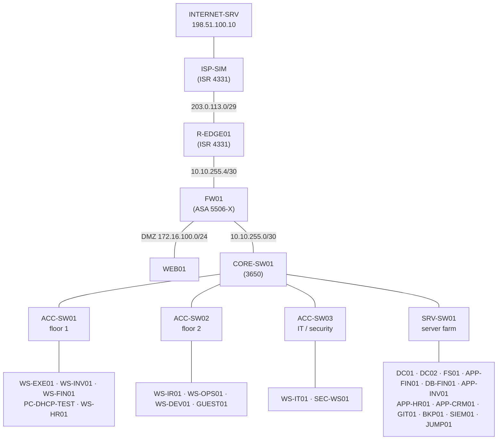

# Build Guide — Moretti Group network in Packet Tracer

Step-by-step instructions to build the topology in **Cisco Packet Tracer 9.0.1** from an empty
workspace. No prior Packet Tracer experience is assumed.

> **[USER ACTION REQUIRED]** Everything in this guide is executed by the lab owner in Packet
> Tracer. The `.pkt` file cannot be generated outside the application.

- **Estimated time:** 3 to 4 hours (can be split across sessions; save often).
- **Output:** `project-01-network/packet-tracer/moretti-group-network.pkt`
- **Configurations:** [`../configs/`](../configs/)
- **Addresses and ports:** [addressing plan](addressing-plan.md)

## Topology



---

## Step 1 — Create and save the file

1. Open Packet Tracer. If macOS blocks it the first time, go to **System Settings → Privacy &
   Security** and click **Open Anyway** for Packet Tracer.
2. **File → Save As** → `~/moretti-group-security-lab/project-01-network/packet-tracer/moretti-group-network.pkt`.
3. Save again (**Cmd+S**) at the end of every step.

## Step 2 — Place the devices

The device picker is in the bottom-left corner: choose a **category** in the top row, then a
**subcategory**, then drag the model into the workspace.

| Quantity | Model | Where in the picker | Names to give them |
|---|---|---|---|
| 1 | **3650-24PS** | Network Devices → Switches | CORE-SW01 |
| 4 | **2960-24TT** | Network Devices → Switches | ACC-SW01, ACC-SW02, ACC-SW03, SRV-SW01 |
| 2 | **4331** | Network Devices → Routers | R-EDGE01, ISP-SIM |
| 1 | **5506-X** | Network Devices → Security | FW01 |
| 11 | **PC** | End Devices → End Devices | WS-EXE01, WS-INV01, WS-FIN01, PC-DHCP-TEST, WS-HR01, WS-IR01, WS-OPS01, WS-DEV01, GUEST01, WS-IT01, SEC-WS01 |
| 14 | **Server** | End Devices → End Devices | DC01, DC02, FS01, APP-FIN01, DB-FIN01, APP-INV01, APP-HR01, APP-CRM01, GIT01, BKP01, SIEM01, JUMP01, WEB01, INTERNET-SRV |

**To rename a device:** click it → **Config** tab → **Display Name**. (For switches, routers and
the firewall, the hostname inside the configuration is set later by the pasted config.)

**Important — the 3650 has no power supply by default.** Click CORE-SW01 → **Physical** tab →
drag **AC-POWER-SUPPLY** from the module list into the empty power slot on the device image.
The switch powers on. Without this, all its links stay red.

**Tip for a clean portfolio screenshot:** group devices by zone (internet, perimeter, core,
floor 1, floor 2, IT/security, servers) and use the rectangle and note tools in the top toolbar
to label each zone.

## Step 3 — Cable everything

Choose **Connections** (lightning bolt icon) → **Copper Straight-Through** (solid black line).
Click the first device, pick the interface, click the second device, pick the interface.

| From | Interface | To | Interface |
|---|---|---|---|
| CORE-SW01 | GigabitEthernet1/0/1 | ACC-SW01 | GigabitEthernet0/1 |
| CORE-SW01 | GigabitEthernet1/0/2 | ACC-SW02 | GigabitEthernet0/1 |
| CORE-SW01 | GigabitEthernet1/0/3 | ACC-SW03 | GigabitEthernet0/1 |
| CORE-SW01 | GigabitEthernet1/0/4 | SRV-SW01 | GigabitEthernet0/1 |
| CORE-SW01 | GigabitEthernet1/0/24 | FW01 | GigabitEthernet1/2 |
| FW01 | GigabitEthernet1/1 | R-EDGE01 | GigabitEthernet0/0/0 |
| FW01 | GigabitEthernet1/3 | WEB01 | FastEthernet0 |
| R-EDGE01 | GigabitEthernet0/0/1 | ISP-SIM | GigabitEthernet0/0/0 |
| ISP-SIM | GigabitEthernet0/0/1 | INTERNET-SRV | FastEthernet0 |
| ACC-SW01 | FastEthernet0/1 | WS-EXE01 | FastEthernet0 |
| ACC-SW01 | FastEthernet0/2 | WS-INV01 | FastEthernet0 |
| ACC-SW01 | FastEthernet0/3 | WS-FIN01 | FastEthernet0 |
| ACC-SW01 | FastEthernet0/4 | PC-DHCP-TEST | FastEthernet0 |
| ACC-SW01 | FastEthernet0/5 | WS-HR01 | FastEthernet0 |
| ACC-SW02 | FastEthernet0/1 | WS-IR01 | FastEthernet0 |
| ACC-SW02 | FastEthernet0/2 | WS-OPS01 | FastEthernet0 |
| ACC-SW02 | FastEthernet0/3 | WS-DEV01 | FastEthernet0 |
| ACC-SW02 | FastEthernet0/4 | GUEST01 | FastEthernet0 |
| ACC-SW03 | FastEthernet0/1 | WS-IT01 | FastEthernet0 |
| ACC-SW03 | FastEthernet0/2 | SEC-WS01 | FastEthernet0 |
| SRV-SW01 | FastEthernet0/1 … 0/10 | DC01, DC02, FS01, APP-FIN01, DB-FIN01, APP-INV01, APP-HR01, APP-CRM01, GIT01, BKP01 (in this order) | FastEthernet0 |
| SRV-SW01 | FastEthernet0/20 | SIEM01 | FastEthernet0 |
| SRV-SW01 | FastEthernet0/24 | JUMP01 | FastEthernet0 |

Link lights start orange (spanning tree converging) and turn green after about 30 seconds.
If the link between R-EDGE01 and ISP-SIM stays red, replace it with **Copper Cross-Over**.

## Step 4 — Set credentials on every network device (before pasting anything)

Credentials are **not** in the repository. Choose your own lab passwords (do not reuse real
ones) and keep them in a password manager. Set them **first**: the configurations enable
`login local`, so pasting them before a user exists would lock you out.

**Switches and routers** (CORE-SW01, ACC-SW01/02/03, SRV-SW01, R-EDGE01). Click the device →
**CLI** tab. On routers, answer `no` to *"Would you like to enter the initial configuration
dialog?"*. Then type:

```
enable
configure terminal
enable secret <your-enable-password>
username netadmin privilege 15 secret <your-admin-password>
end
```

**Firewall** (FW01) → CLI tab. At the `Password:` prompt after `enable`, just press Enter.

```
enable
configure terminal
enable password <your-enable-password>
username netadmin password <your-admin-password> privilege 15
end
```

ISP-SIM is not a company device and does not need credentials.

## Step 5 — Paste the base configurations

Order: **ISP-SIM → R-EDGE01 → FW01 → CORE-SW01 → ACC-SW01 → ACC-SW02 → ACC-SW03 → SRV-SW01**.
**Do not paste `generated/CORE-SW01-acls.txt` yet** — that comes in step 9.

For each device:

1. Open the file from [`../configs/`](../configs/) in a text editor and copy it.
2. Device → **CLI** → type `enable`, then `configure terminal`.
3. Paste (**Cmd+V**). For long files, paste one section at a time (sections are separated by
   `! -----` lines). Packet Tracer can drop lines when a very large block is pasted at once.
4. Look for `% Invalid input` messages. Note the command and continue; see Troubleshooting.
5. Save the configuration: `write memory`.

**Firewall note:** the ASA file starts with `clear configure dhcpd`, `clear configure nat` and
`clear configure object` to remove the factory defaults. If Packet Tracer rejects one of these,
run `show running-config`, and remove any leftover `nat` or `dhcpd` lines with `no` in front of
them.

## Step 6 — Generate SSH keys

SSH needs an RSA key, and the key needs the hostname and domain set by the pasted config.

- **Switches and R-EDGE01:** in configuration mode, `crypto key generate rsa`. When asked
  *"How many bits in the modulus"*, type `2048`. Then `end` and `write memory`.
- **FW01:** in configuration mode, `crypto key generate rsa modulus 2048`, then `write memory`.

## Step 7 — Configure the servers

For every server: click it → **Desktop → IP Configuration** → **Static** → enter IP, subnet
mask, default gateway and DNS from the [addressing plan](addressing-plan.md#5-hosts-in-the-packet-tracer-topology).

Then open the **Services** tab. Packet Tracer servers start with several services enabled.
**Turn off every service that is not listed below for that server** (at least HTTP, HTTPS, FTP
and EMAIL) — a server should run only what it needs.

| Server | Services to turn **on** | Details |
|---|---|---|
| DC01 | DHCP, DNS, NTP | DHCP pools and DNS records below |
| APP-FIN01, APP-INV01, APP-HR01, APP-CRM01, GIT01, WEB01 | HTTPS only | Edit `index.html` to show the server name, e.g. `<h1>APP-FIN01 - Finance application</h1>` |
| SIEM01 | SYSLOG | Received messages appear in this window |
| INTERNET-SRV | HTTP, HTTPS, DNS | DNS records below |
| DC02, FS01, DB-FIN01, BKP01, JUMP01 | none | These represent services Packet Tracer cannot simulate |

**DC01 → DHCP.** Add one pool per line of the
[DHCP table](addressing-plan.md#6-dhcp-pools-on-dc01) (fill the fields, click **Add**). Edit
the existing `serverPool` to gateway `10.10.80.1`, DNS `10.10.80.10`, start `10.10.80.200`,
max users `10` (servers use static addresses, so it stays unused). Set the service **On**.

**DC01 → DNS.** Service **On**, then add these **A records**:

| Name | Address |
|---|---|
| dc01.corp.moretti.internal | 10.10.80.10 |
| dc02.corp.moretti.internal | 10.10.80.11 |
| fs01.corp.moretti.internal | 10.10.80.20 |
| app-fin01.corp.moretti.internal | 10.10.80.30 |
| app-inv01.corp.moretti.internal | 10.10.80.40 |
| app-hr01.corp.moretti.internal | 10.10.80.50 |
| app-crm01.corp.moretti.internal | 10.10.80.60 |
| git01.corp.moretti.internal | 10.10.80.70 |
| siem01.corp.moretti.internal | 10.10.70.10 |
| jump01.corp.moretti.internal | 10.10.10.20 |

**INTERNET-SRV → DNS.** Service **On**, A records: `www.example.org` → `198.51.100.10`,
`www.moretti-lab.test` → `203.0.113.3`.

## Step 8 — Configure the PCs and test basic connectivity

For each PC: **Desktop → IP Configuration → Static**, values from the
[addressing plan](addressing-plan.md#5-hosts-in-the-packet-tracer-topology).
**PC-DHCP-TEST** uses **DHCP** instead.

Now run **Stage 1** of the [validation plan](validation-plan.md) (tests C-01 to C-06). Fix any
failure **before** applying the ACLs: at this point every internal host can reach every other,
so a failure here is a routing, VLAN or cabling problem, not a filtering one.

## Step 9 — Apply the inter-VLAN ACLs

CORE-SW01 → CLI → `enable` → `configure terminal` → paste
[`../configs/generated/CORE-SW01-acls.txt`](../configs/generated/CORE-SW01-acls.txt), one
`ip access-list` block at a time. Then `write memory`.

Check that they are attached: `show ip interface vlan 20 | include access list` should show
`Inbound access list is ACL-IN-FINANCE`.

## Step 10 — Validate

Run stages 2, 3 and 4 of the [validation plan](validation-plan.md) and record what you
observe, with screenshots in `project-01-network/documentation/evidence/`. Save the `.pkt`.

## Step 11 — Version the result

```bash
cd ~/moretti-group-security-lab
git add project-01-network/packet-tracer/moretti-group-network.pkt project-01-network/documentation/
git commit -m "Build Packet Tracer topology and record validation results"
```

---

## Troubleshooting

| Symptom | Likely cause | Check / fix |
|---|---|---|
| Every link on CORE-SW01 is red | 3650 without power supply | Step 2: add AC-POWER-SUPPLY |
| A link stays red | Port shut down or wrong cable | `show ip interface brief`; `no shutdown`; try Cross-Over |
| PC cannot ping its gateway | Wrong VLAN on the access port, or wrong IP/mask | `show vlan brief` on the access switch; PC IP configuration |
| Gateway reachable, other VLANs not (before ACLs) | Trunk missing the VLAN | `show interfaces trunk` on both ends |
| PC-DHCP-TEST gets no address | Relay, pool or snooping | `ip helper-address` on the SVI; DC01 pool gateway `10.10.20.1`; `ip dhcp snooping trust` on SRV-SW01 Fa0/1 and the uplinks |
| Internet unreachable | NAT, ASA ACL or routes | R-EDGE01: `show ip nat translations`, `show ip route`; FW01: `show access-list`, `show route` |
| SSH refused | Missing RSA key or user, or not connecting from JUMP01 | Step 6; `show ip ssh`; `show access-lists ACL-VTY-MGMT` |
| `% Invalid input detected` while pasting | Command not supported in this Packet Tracer version | Note the command and device; it is recorded as a simulator limitation |
| A test in stage 2 fails after step 9 | ACL | `show access-lists ACL-IN-<VLAN>`: the counters show which entry matched; use Simulation mode to see where the packet is dropped |

### Useful commands

| Device | Command | Shows |
|---|---|---|
| Switches | `show vlan brief` | VLAN of each port |
| Switches | `show interfaces trunk` | Trunks, native VLAN, allowed VLANs |
| Switches | `show port-security` | Port security status and violations |
| Switches | `show ip dhcp snooping` | Snooping VLANs and trusted ports |
| CORE-SW01 | `show ip interface brief` | SVIs and their state |
| CORE-SW01 | `show access-lists` | ACL entries and match counters |
| CORE-SW01 | `show ip route` | Routing table |
| FW01 | `show nameif`, `show route`, `show access-list` | Interfaces, routes, rule hits |
| R-EDGE01 | `show ip nat translations` | Active NAT entries |
